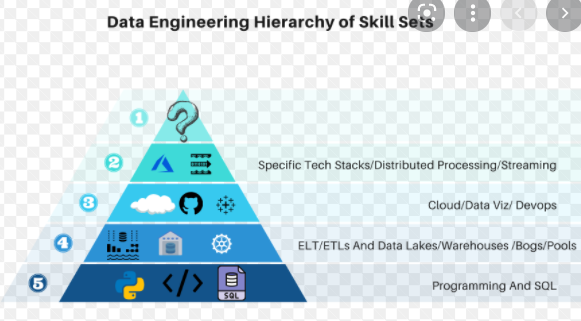

## Some-interview-question
<!-- TABLE OF CONTENTS -->

## Introduction to Data Engineering:
Data engineering usually falls under Business Intelligent department of a company, this a specific discipline that require different set of skills. You manage the data life cycle - from its creation to its storage and to its end use, as well as archiving and maintenance. 

You build the data infransturcture/platform that is achieve the following: ingesting and storage of large volume of data, feed the data scienstis's machine learning model, drive the businees intelligent/visuallization tool like tableau, powerBI, superset. 

"Most of the time these guys start as traditional solution architects for systems that involve SQL databases, web servers, SAP installations and other standard systems.
But to create big data platforms the engineer needs to be an expert in specifying, setting up and maintaining big data technologies like: Hadoop, Spark, HBase, Cassandra, MongoDB, Kafka, Redis and more." - by  andkret

You have to learning how to make these tool work together, because there is no framework that you can use to build a data infransture, you have to build a lot of tool youself. there is also no standard design pattern for building a pipeline. but you can take the priciple from software engineering like Open Close principle, or design pattern like factory design pattern to code your data pipeline.



# DataEngineering
### 1) Data modeling: define entity, relationship and rules
### 2) design schema of datawarehouse:  Snowflake and Star schema
### 3) structured data, unstructured data example
### 4) Hadoop Component: HDFS, MapRed, Yard
### 5) explain map, shuffle, and reduce
### 6) Spark Component: Master, Worker, resource manager
### 7) Spark cluster mode and client mode
### 8) Spark Narrow and wide transformation
### 9) what database you worked with?
### 10) what are some of the hive complex data type, Map,Struct,Array,Union,   what explode function do?
### 11) UDF?
### 12) external table, and internal table/ managed table?
### 13) what is schema on read?
### 14) what are the biggest challent in you previou project, and how you solve?
### 15) what are you hoping to Develop in your next project?
### 16) arvo and parquet,
### 17) what are some of the complex sql/transformation you written?
### 18) Database design
### 19) System Design
### 20) Data structure and Algorithm 
### 21) spark, what are the challenge/con of spark?  - Non ACID, C:consistence, spark save mode overwrite is delete and write operation, data loss when runtime exception occured,     No schema enforcement,  Small file problem in real scienario, (large volume of small files creat overhead in spark driver to maintain the file list, and meta data, opening/closing IO, ineffective compression)
### what to consider when building a ETL pipeline:
Data QA/validation infrastructure

Error Handling and Logging

Dashboard for tracking

Data Lineage and Data Catalogs

Metadata Database

# New
### Query performance
indexing, partition, avoid correlated query, 

### large delete operation
large delete operation will hang the database,  so batch delete instead - specific data range, loop through the range and perform delete. batch delete will release the resouce upon each batch completion where as large deletion will block other transaction.


### SQL find distance drove by each diver
```
driver_id, vehicle_id, odometer_reading, date
1	 ,  100      , 10              , 2022-01-01
1	 ,  100      , 25              , 2022-01-02
1	 ,  100      , 30              , 2022-01-03
2	 ,  100      , 60              , 2022-01-04
2	 ,  100      , 70              , 2022-01-05
2        ,  200      , 50              , 2022-01-06
1        ,  100      , 100             , 2022-01-06

note: a vehicle can be drived by different driver at different date, odometer_reading capture the current reading when driver start to use that vehicle in the day.
a driver can drive a vehicle and and come by to the vehicle at different date

this DOES NOT work
lag(odometer_reading) over (partition by driver_id, vehicle_id order by date asc) as previous_reading
=>
driver_id, vehicle_id, odometer_reading,previous_reading, date 
1	 ,  100      , 10              ,null            , 2022-01-01
1	 ,  100      , 25              ,10                2022-01-02,  
1	 ,  100      , 30              ,25                2022-01-03,  
2	 ,  100      , 60              ,null              2022-01-04,
2	 ,  100      , 70              ,60                2022-01-05
2        ,  200      , 50              ,null              2022-01-06
2        ,  200      , 80              ,50                2022-01-07
1        ,  100      , 100             ,30                2022-01-08   *** this is wrong, artition by driver_id, vehicle_id, skip the mile drove by user 2, should be 70 (the reading from 2022-01-05 drove by user 2)

if you do, over (partition by vehicle_id 
this will not work either 
2	 ,  100      , 70              ,60                2022-01-05
2        ,  200      , 50              ,null              2022-01-06
2        ,  200      , 80              ,50                2022-01-07
1        ,  100      , 100             ,70***             2022-01-08   70 is from user 2, 100-70 = 30 is actually drove by user 2 at 2022-01-05

*** Correct Solution
lead(odometer_reading) over (partition by vehicle_id order by date asc) as next_reading
driver_id, vehicle_id, odometer_reading,next_reading   , date 
1	 ,  100      , 10              ,25            , 2022-01-01
1	 ,  100      , 25              ,30                2022-01-02,  
1	 ,  100      , 30              ,60                2022-01-03,  
2	 ,  100      , 60              ,70              2022-01-04,
2	 ,  100      , 70              ,100                2022-01-05
2        ,  200      , 50              ,80              2022-01-06
2        ,  200      , 80              ,null                2022-01-07
1        ,  100      , 100             ,null                2022-01-08 

next_reading - odometer_reading = distance user drove for current date.
next_reading is the starting odometer_reading of whoever use the vehicle next day.

in last row, we dont know what happen after 2022-01-08 so we can not calcuale the distance. 

create table trips (
    trip_id serial primary key,
    driver_id int,
    vehicle text,
    starting_mileage int,
    date text
);

insert into trips(driver_id, vehicle, starting_mileage, date ) values (
1, 'Tesla', 100, '2023-01-02'),
(1, 'Tesla', 150, '2023-01-03'),
(2, 'Tesla', 230, '2023-01-05'),
(1, 'Honda', 220, '2023-01-05'),
(3, 'Honda', 300, '2023-01-06'),
(3, 'Honda', 400, '2023-01-07'),
(1, 'Tesla', 300, '2023-01-07'),
(2, 'Honda', 530, '2023-01-08')
;


Given a table with driver_id, vehicle, starting_mileage, date
Find number of miles each driver drove per date.

```

### SQL find customer tenure 
```
customer_id, activity, timestamp
1, log in, 2020-01-01
2,  log in, 2020-02-01
1, log in, 2020-03-01
2, log in, 2020-05-01
3, log in, 2020-04-01

## find the first time the customer ever log in (new customer),
## find the most recent time the customer logged in. 
## substract them

group the customer into group based on tenure with 30 day increment. 0-30day group1, 30-60 day group2, etc

select FLOOR(tenure / 30 ) , xxx, group by FLOOR(tenure / 30 )

```


# Linux 
### 1) Remove all file under certain path with certain date range: older than 30 day
find /var/log -name "*.log" -type f -mtime +30 -exec rm -f {}  

### 2) Rename all file with pattern 
for f in *.jpg; 
	do mv "$f" "$(echo "$f" | sed s/IMG/VACATION/)"; 
	done

### 3) Find distinct value from a file 
cut -d' ' -f2 list.txt | sort -u | wc -l
| sort | uniq
uniq -d gives only the duplicates, uniq -u gives only the unique ones (strips duplicates).

### 4) Remove all file recursively 
rm - R

### 5) Linux command to check resource 
```
free - m
Vmstat -s 
top	
htop
Check running process
ps -a /  ps -aux | less 		 ps aux | grep firefox
```
## Spark
### 1) What is spark lineage graph?
	logical execution that log all RDD operation, and link each RDD transformation to its parent RDD
	In case of task failure, spark is able to reexecute the task using lineage graph in DAG. This is how spark achivev fault tolerance/resiliant 
	What is DAG?
	DAG is more high level, DAG show different stage of a spark job, tranformation, join etc

Python:  string.join() 
	List[124] 	list.sum       list.max 

### 2) Spark -client mode and cluster mode 
	Client mode run on local and cluster mode utilize cluster

### 3) wide transformation narrow transformation
	wide - shuffle occur/ data move across the note -> groupby , reduceby, collect
	narrow - map 
### 4) RDD vs DataFrame vs Datasets

### 5) Partitioning and Bucketing

### 6) spark run out of memory:  driver out of memory on collect action, or executor our of memory on big partition

### 7) How to turn a spark executor

### 8) broadcast join?

### 9) what are transformation, what are actions?

### 10) optimization techique:  Push down partition filter, use broast variable, cache the dataframe if reused (after a action eg. save()), dont use UDF, use built in function as much as you can, use map partition for heavy initialization task (connecting to db/ initiating a ML model).  

## SQL/Hive 
### 1) find top 3 paying employee from each department 
	Select dept_id, employee_id, rank() over (partition by dept_id, order by salary desc) rnk from table where rnk < 3
	Select alternative row
	Select name, row_number() over (partition by id) row from xx where row_num %2 = 0
### Rank and dense rank
### 2) Hive, complex data type : map   is similar to a dictionary in Python.
	What is ‘Explode’ function 

### 3) SQL vs no SQL 
	when you data is sturctured and you need ACID compliance which apply to most transaction opertion ->SQL
	if you data is unstructured -> noSQL
	noSql, you dont need to predefined schema, data can be column stored, document stored, key-value stored
		can scale horizontally 
	use case noSQL:  article content, social media post, sensor data, other unsturctured data that wont fit neatly in sql db
	
### 4) ACID
	atomicity. one transaction either happen or not happen.
	
### 5) find duplicate at row level: select every column group by every column having count(*) >1

### 6) compare two tables: select every column from (tables unioned) group by every column having count(*) >1


## Kafka
### 1) why do you need a publish and subscriber system?
	to decouple, to isolate the write and process capability of source and consumption. 
	producer and consumer can work at different speed
	
	
